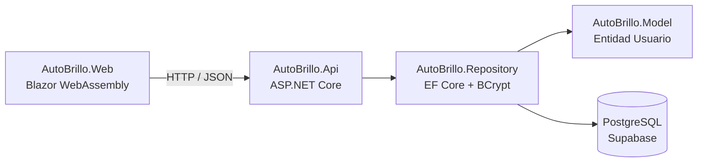

# 🚗 AutoBrillo

Sistema académico sencillo para la gestión inicial de un lavadero de autos. El proyecto fue pensado para una exposición universitaria: usa una arquitectura por capas clara, nombres y comentarios en español, y evita patrones complejos.

## Enlaces publicados

- **Aplicación web:** https://autobrillo-web.vercel.app
- **API:** https://autobrillo-api.179.199.139.243.nip.io/health
- **Base de datos:** PostgreSQL administrado en Supabase

## Funcionalidades actuales

- Inicio de sesión con `Nombre` y `Password`.
- Registro de usuarios desde la API.
- Contraseñas almacenadas como hash BCrypt, nunca como texto plano.
- Página de inicio protegida por sesión.
- Barra superior con nombre del usuario y cierre de sesión.
- Verificación de estado de la API mediante `/health`.

> La aplicación contiene únicamente las pantallas **Login** e **Inicio**, porque es la primera versión académica del sistema.

## Arquitectura



La web no se conecta directamente a Supabase. Todo acceso a datos ocurre mediante la API y la capa `Repository`.

## Proyectos de la solución

| Proyecto | Responsabilidad |
|---|---|
| `AutoBrillo.Model` | Entidades del dominio. Actualmente contiene `Usuario`. |
| `AutoBrillo.Repository` | Acceso a datos con Entity Framework Core, PostgreSQL y hash BCrypt. |
| `AutoBrillo.Api` | API HTTP/JSON, autenticación JWT, CORS y endpoints. |
| `AutoBrillo.Web` | Interfaz Blazor WebAssembly. Consume exclusivamente la API. |

## Base de datos

La tabla inicial se llama `usuarios`:

```sql
create table public.usuarios (
  "Id_Usuarios" integer generated by default as identity primary key,
  "Nombre" varchar(100) not null unique,
  "Password" varchar(255) not null
);
```

`Password` guarda exclusivamente un hash generado con BCrypt desde C#.

## Ejecución local

### Requisitos

- .NET SDK 10.
- Una base PostgreSQL o un proyecto Supabase.
- Variables de entorno configuradas para la API.

### 1. Restaurar y compilar

```bash
dotnet restore
dotnet build AutoBrillo.slnx
```

### 2. Configurar la API

En una terminal, definir las variables sin guardarlas en Git:

```bash
export CONNECTION_STRING='Host=...;Database=...;Username=...;Password=...;SSL Mode=Require'
export JWT_SECRET='una-clave-larga-privada'
export JWT_ISSUER='AutoBrillo.Api'
export JWT_AUDIENCE='AutoBrillo.Web'
export WEB_ORIGIN='http://localhost:5000'
```

### 3. Iniciar la API

```bash
dotnet run --project src/AutoBrillo.Api
```

### 4. Iniciar la web

En otra terminal:

```bash
dotnet run --project src/AutoBrillo.Web
```

La URL local se muestra en la consola de .NET.

## Documentación

- [Arquitectura y estructura de carpetas](docs/arquitectura.md)
- [Referencia de la API](docs/api.md)
- [Despliegue y configuración](docs/despliegue.md)

## Seguridad de configuración

Los secretos no se incluyen en el repositorio. Archivos como `.env.production`, `appsettings.Development.json` y `.supabase-db-password` están ignorados por Git. Para compartir el proyecto, cada integrante debe definir sus propias variables de entorno.

## Estado del proyecto

La solución compila correctamente con .NET 10. La web está publicada en Vercel y la API se ejecuta en un VPS Hostinger con Docker, HTTPS y Traefik.
