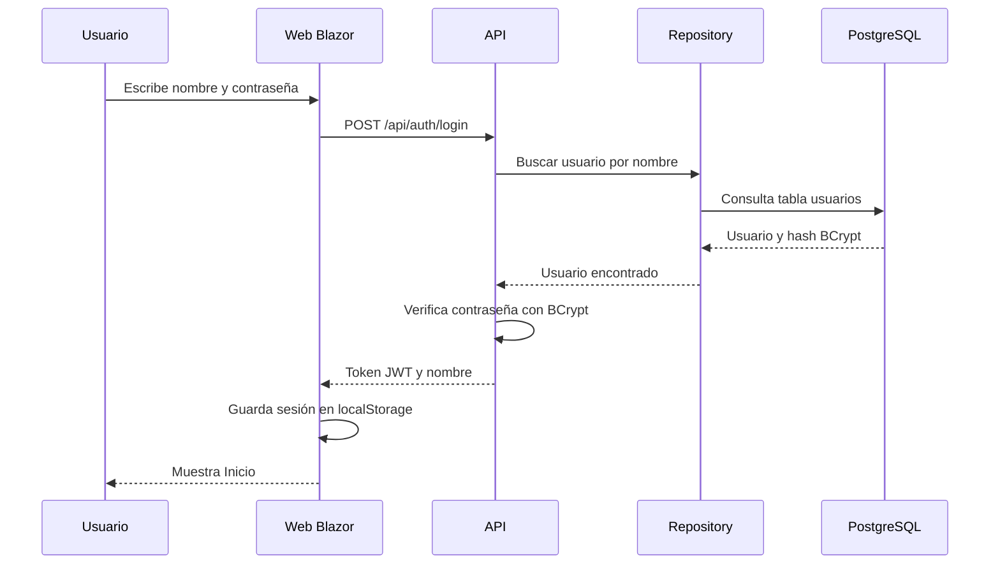

# Arquitectura de AutoBrillo

## Objetivo

AutoBrillo usa una arquitectura por capas para separar responsabilidades sin complicar el código. Cada proyecto tiene una función puntual y se comunica con el siguiente de manera ordenada.

```text
AutoBrillo.Web → API HTTP/JSON → Repository → Model → PostgreSQL
```

## Capas

### 1. AutoBrillo.Model

Contiene las entidades del sistema. No conoce la base de datos ni las pantallas.

Actualmente incluye la entidad `Usuario`:

- `Id_Usuarios`: identificador entero autoincremental.
- `Nombre`: nombre único del usuario.
- `Password`: hash BCrypt de la contraseña.

### 2. AutoBrillo.Repository

Es la capa que se comunica con PostgreSQL usando Entity Framework Core.

Componentes principales:

- `Datos/AutoBrilloDbContext.cs`: configura la tabla `usuarios`.
- `Repositorios/IUserRepository.cs`: contrato simple para usuarios.
- `Repositorios/RepositorioUsuarios.cs`: consultas y guardado de usuarios.
- `Seguridad/PasswordHasher.cs`: genera y verifica hashes BCrypt.

Esta separación permite reemplazar PostgreSQL por MariaDB en el futuro cambiando principalmente el proveedor de Entity Framework Core, sin modificar la web.

### 3. AutoBrillo.Api

Expone los datos y operaciones mediante HTTP/JSON.

Responsabilidades:

- Registro e inicio de sesión.
- Generación y validación de tokens JWT.
- Política CORS para permitir solo el origen de la web publicada.
- Endpoint de estado `/health`.
- Inyección de dependencias de Repository y DbContext.

La API no envía hashes de contraseñas al cliente.

### 4. AutoBrillo.Web

Es una aplicación Blazor WebAssembly. Se ejecuta en el navegador y usa `HttpClient` para comunicarse con la API.

Pantallas actuales:

- `Login.razor`: formulario de acceso.
- `Inicio.razor`: pantalla inicial protegida.
- `Shared/MainLayout.razor`: barra superior y botón de cerrar sesión.

El servicio `ServicioAutenticacion` guarda el token y el nombre de usuario en `localStorage`, valida la sesión llamando a `GET /api/auth/me` y borra los datos al cerrar sesión.

## Flujo de inicio de sesión



## Decisiones de diseño

- Se eligieron nombres en español para facilitar la lectura y defensa en clase.
- No se utilizan microservicios, CQRS, MediatR ni capas adicionales.
- No existe proyecto de pruebas por alcance académico definido.
- La web no posee cadena de conexión ni acceso directo a Supabase.
- Las credenciales se suministran por variables de entorno, no desde el código fuente.
